# RADIANT Program — Integrated EHR and Imaging Exchange Blueprint (Bulk FHIR + DICOMweb) — v2.0

**Executive summary**  
RADIANT centralizes *Bulk FHIR* data for a consented cohort and complements it with *DICOMweb* imaging exchange. 
This unified specification consolidates multiple documents and conversations into a single, vendor‑neutral blueprint that scales from **5 → 30 → 200+ sites**, minimizing lift for each hospital while preserving strong consent gating, auditability, and performance. The architecture supports both modern DICOMweb-enabled systems and legacy DIMSE-only PACS through multiple flexible deployment paths, recognizing the heterogeneous reality of medical imaging infrastructure.

**Background**

*The Current State of Medical Imaging Protocols*

While the vast majority of modern Picture Archiving and Communication System (PACS) imaging platforms offer DICOMweb support, it is not yet a universally implemented standard across all systems. The trend is strongly towards adoption, driven by the increasing demand for web-based and cloud-native solutions in medical imaging.

DICOMweb offers a modern, web-friendly alternative to the traditional DICOM DIMSE (DICOM Message Service Element) protocols. It uses standard web technologies like HTTP/S, making it easier to access and share medical images across different platforms and devices, including web browsers and mobile applications. This is a significant advantage for teleradiology, remote diagnostics, and patient access to their own imaging data.

Most major PACS vendors now include DICOMweb services such as WADO-RS (Web Access to DICOM Objects - RESTful Services), QIDO-RS (Query based on ID for DICOM Objects - RESTful Services), and STOW-RS (Store Over the Web - RESTful Services) in their offerings. This allows for seamless integration with other modern healthcare IT systems and facilitates the development of innovative applications that leverage medical imaging data.

However, several factors contribute to the fact that not every "modern" PACS platform may have full DICOMweb integration out-of-the-box. Many healthcare facilities still rely on legacy imaging modalities and departmental systems that exclusively use the older DIMSE protocols. To ensure backward compatibility and a smooth workflow, many PACS platforms operate in a hybrid mode, supporting both traditional DICOM and the newer DICOMweb standards.

The implementation of DICOMweb can also present challenges, including the complexity of integrating it with existing infrastructure and concerns about data security over the web, although robust security measures are part of the DICOMweb standard. In conclusion, while the momentum is clearly behind DICOMweb as the future of medical imaging access and exchange, it is more accurate to say that most, but not all, modern PACS platforms currently support it. As the industry continues to move towards cloud-based and interoperable solutions, comprehensive DICOMweb support is expected to become an even more standard feature in all contemporary PACS offerings.

*RADIANT's Protocol-Agnostic Approach*

Recognizing this heterogeneous landscape, RADIANT has designed a protocol-agnostic architecture that meets healthcare institutions where they are today while providing a clear path to modernization. Whether a site has cutting-edge DICOMweb capabilities, relies on traditional DIMSE protocols, or operates in a hybrid environment, RADIANT provides multiple integration pathways that minimize local implementation burden while maintaining enterprise-grade security and consent management.

*Why these innovations, and why now*

Even as health systems modernize their electronic health records (EHRs), multimodal integration of clinical and imaging data still breaks down at the edges: cross‑vendor networks, cross‑institution routing, and consent‑scoped retrieval of pixels—not just text/reports. For file-based, imaging data, status quo forces workarounds (CDs, ad‑hoc portals, one‑off gateways), which are limited, slow, and brittle. Real‑world experience shows that stitching together multiple vendor gateways and/or institutional processes for provisioning imaging data manually can increase reliable import/export volumes without forcing every partner onto a single platform. However, the scalability of such efforts is limited to the 10s of institutions, and not 100s or 1000s.

RADIANT's approach generalizes those lessons across 200+ pediatric institutions: use registry‑scoped Bulk FHIR to discover exactly which patients/studies are in‑scope (the "who/what"), then use DICOMweb (QIDO/WADO) to retrieve the imaging pixels and metadata (the "where/how"), with an enforcement layer that only permits requests for studies that appear in a signed, per‑site cohort snapshot. That enforcement can live in a central gateway, a site PDP (policy decision point), a site edge connector, or a cloud DICOMweb front‑end—so the "lowest bar" looks different for a community hospital than for an academic IDN, but the security, audit, and throughput expectations remain consistent.

For sites with legacy DIMSE-only PACS, RADIANT provides multiple integration paths ranging from zero-touch cloud gateways to lightweight forwarders, ensuring no site is excluded due to technical limitations. This inclusive approach recognizes that healthcare IT modernization is a journey, not a destination, and that valuable clinical data exists across the entire spectrum of technical capabilities.

*Why multimodal data integration matters for AI*

Best‑in‑class clinical AI models are moving beyond single‑modality inputs. To achieve generalizable results and safe clinical deployment, models need governed access to aligned pixels (DICOM), waveforms (e.g., ECG/EEG), multi‑omics (genomics, proteomics), continuous telemetry, pathology slides (WSI/DIOCM), and narrative context (notes, PDFs). RADIANT's cohort‑snapshot control plane, unified audit, and policy‑enforced APIs turn today's asynchronous, cross‑institutional, file‑based reality into a dependable substrate for training, validation, and bedside inference. Because the scheme is standards‑first and system‑agnostic, it invites innovation while preserving local autonomy and security. To be clinically useful and reproducible, those models need cohort‑accurate, longitudinal, and consent‑honoring data feeds that span:
	•	Asynchronous flows (bulk exports, batched imaging pulls, event‑driven deltas);
	•	Cross‑institution boundaries (each with different networks, firewalls, and governance); and
	•	Multiple data shapes (file‑based, document‑based, and API‑native).
 
*Extensibility of file-based workflows beyond radiology*

The same pattern extends well beyond radiology. Waveforms can be exchanged using vendor APIs or IHE profiles with the PEP enforcing cohort membership. Genomic files (e.g., VCF, BAM/CRAM) can be registered via FHIR Genomics resources and delivered through governed object storage links with short‑lived credentials. Pathology whole‑slide images (WSI/DICOM) can be retrieved via DICOM‑WSI endpoints where available or proxied through a site edge. In each case, the cohort snapshot carries the authoritative list of allowed objects, the PEP enforces it, and the audit layer proves who accessed what, when, and why. The "discover → snapshot → retrieve (with policy)" pattern extends cleanly to other high‑value modalities. In each case, discovery uses FHIR (or an EHR‑native feed) to identify cohort‑scoped artifacts; retrieval uses a modality‑appropriate service; and access is gated by the same PEP/PDP controls and audit.

| Modality | Discovery (FHIR examples) | Retrieval / Payload | Notes on Gatekeeping & Audit |
|---|---|---|---|
| **General radiology** | `ImagingStudy`, `DiagnosticReport`, `ServiceRequest`, `Endpoint` via Bulk FHIR | DICOM over **WADO‑RS** (`application/dicom`) or DIMSE (C-MOVE/C-STORE); QIDO for enumeration | PEP enforces snapshot allow‑list (Study/Series/SOP UIDs). Optional PDP at site for real‑time veto; audit every request. |
| **Radiation Oncology (DICOM‑RT)** | `ImagingStudy` (for planning CT/MR), `ServiceRequest`/`Procedure` for RT course context; optional `DocumentReference` for plans/reports | **DICOM‑RT** objects over WADO‑RS or DIMSE (e.g., *RT Plan*, *RT Dose*, *RT Structure Set*, *RT Beams/Records*). Associate via Study/Series/Frame‑of‑Reference or explicit Plan UID. | Gate by **Study UID** and/or **RT Plan UID**; audit device/beam metadata and dose files retrieved. Enforce **IOCM** (replacements) and revocation SLA. |
| **Digital pathology / WSI** | `DiagnosticReport` + `Observation` (codes), `DocumentReference` | DICOM‑WSI via WADO‑RS or IIIF; tiles/levels streamed | Use same snapshot gating by case/slide UIDs; streaming proxy recommended for large tiles. |
| **Waveforms (ECG/EEG/NICU)** | `Observation`, `Device`, `Encounter` | DICOM Waveform via WADO‑RS; for near‑real‑time, HL7 v2/IEEE 11073 bridges | Edge connector batches telemetry → files (STOW‑RS). Audit device IDs, intervals, and gaps. |
| **Genomics** | `MolecularSequence` / `Observation.genetics` / `DocumentReference` | GA4GH DRS/htsget/refget object APIs or `Binary` with file links | PDP can enforce IRB/data‑use limits. Log checksums & provenance in snapshot. |
| **Sensor & at‑home data** | `Observation`, `Device`, `MeasureReport` | Vendor APIs normalized into FHIR; files in S3‑style object store via presigned URLs | Same per‑site throttles; cohort scoping by protocol enrollment. |
| **Documents (operative notes, outside reports)** | `DocumentReference`, `Composition` | C‑CDA or PDF via FHIR `Binary`/DTR | Snapshot keeps canonical URI + hash; PDP may require facility patient‑matching. |

*Where today's U.S. policy and standards fall short—and how we bridge the gaps*

Rather than wait for uniform adoption, RADIANT provides a glide path that meets sites where they are. As USCDI and ONC certification criteria add imaging links and richer imaging modules, sites can migrate seamlessly—because the central authorization, audit, and throughput controls remain the same.

- **USCDI is necessary but not sufficient.** The United States Core Data for Interoperability (USCDI) defines which data elements must be interoperable, not how to move pixels. USCDI v6 now identifies imaging‑relevant elements like Imaging Reference and Accession Number, which help link an imaging report or ImagingStudy to the actual images—but USCDI itself doesn't deliver DICOM instances or prescribe DICOMweb transport (furthermore, implementation of USCDI V3 is only staged for this year with V6 further in the future). However, RADIANT has defined an immediate, scalable framework for coupling USCDI‑anchored discovery with both DICOMweb and DIMSE retrieval.

- **The imaging community is pushing for stronger linkage.** RSNA publicly supported adding Imaging Reference and Accession Number to USCDI v6 as a step toward consistent pointers from EHR records to images, improving coordination and reducing duplicative scans. RADIANT operationalizes those pointers by requiring that any imaging request correspond to a study enumerated in the Bulk FHIR output and the signed cohort snapshot.

- **ONC's HTI‑2 raises the floor but doesn't solve pixels.** ONC's HTI‑2 rulemaking advances certification and algorithm transparency and tightens the alignment with USCDI versions, but it does not (yet) mandate standards‑based cross‑network image retrieval (e.g., DICOMweb) as part of certified workflows. The RADIANT architecture closes that gap with policy‑enforced DICOMweb paths, DIMSE bridges, and site‑veto (PDP) options.

- **TEFCA is maturing toward FHIR, not images—yet.** TEFCA establishes the trust fabric for nationwide exchange and is moving toward QHIN‑to‑QHIN FHIR API exchange (pilots targeted around 2025 and broader deployment through 2026 per the RCE Roadmap). TEFCA doesn't currently define a nationwide pathway for DICOM pixel exchange. RADIANT's model is TEFCA‑compatible (it uses standards, strong identity, and auditable exchange) while providing an immediate, pragmatic lane for imaging via both DICOMweb and DIMSE today.

**Core posture**
- **Discovery** via Epic (or equivalent) *registry‑scoped* **Bulk FHIR** ($export) to enumerate *ImagingStudy*, *DiagnosticReport*, *ServiceRequest*, and target **Endpoint**s.
- **Enforcement** via a **cohort Snapshot** (signed, versioned) and a **Policy Enforcement Point (PEP)**; optional **Policy Decision Point (PDP)** at the site for real‑time veto.
- **Retrieval** via **DICOMweb** (**QIDO‑RS** for query, **WADO‑RS** for pixel/metadata, optional **STOW‑RS** for store) or **DIMSE** (C-FIND/C-MOVE/C-STORE), with per‑site throttles and comprehensive audit.
- **Deployment options** A–J accommodate sites with different maturity: from zero-configuration cloud solutions to fully managed services, supporting both DICOMweb and DIMSE protocols.
- **Operations at scale**: trust registry, throughput governor with circuit breakers, error recovery mechanisms, SLOs, dashboards, and comprehensive disaster recovery; onboarding tests and incident runbooks.
- **API Versioning**: All APIs follow semantic versioning (v1, v2) with guaranteed backward compatibility for 24 months minimum.


## 1) Roles, trust model, and governance

**Actors**
- **Local Site**: hospital/health system operating the EHR (Epic/Cerner), registries, and PACS/VNA (with DICOMweb, DIMSE, or hybrid capabilities).
- **Central Hub (RADIANT)**: Bulk FHIR scheduler, Cohort Snapshot Service, PEP gateway, retrieval/storage, audit console, onboarding/validation services, cloud DIMSE gateway services.
- **Cohort**: The set of patients enrolled/consented for the protocol and authorized for exchange via RADIANT.
- **PEP (Policy Enforcement Point)**: gateway that authorizes and proxies DICOMweb requests using Snapshot membership and optional PDP.
- **PDP (Policy Decision Point)**: site‑controlled webhook that can ALLOW/DENY a request in real time (e.g., Lyniate Rhapsody route).

**Trust Registry (TR)** — *what it is & how it works*  
A multi‑tenant, signed **system‑of‑record** that stores per‑site identities, endpoints, keys/certificates, network policy (IP allow‑lists, mTLS), throughput caps, maintenance windows, and DICOM-specific configurations (AE Titles, ports, transfer syntaxes).  
APIs provide signed read‑only access for schedulers/gateways; every change is versioned and audited. The TR enables routine rotation of OAuth keys and mTLS certs and drives safe automation (e.g., snapshot TTLs, rate limits).


## 2) Architecture overview (discovery → enforcement → retrieval)

1. **Bulk FHIR discovery** (SMART Backend Services): $export against registry‑scoped Groups (e.g., "All Patients", "New Patients") returns NDJSON for the cohort. Epic registries provide nightly refreshes as baseline.

2. **Change Data Capture (CDC) Enhancement**: While Epic registries provide nightly refreshes, implement supplemental CDC for critical events:
   - Real-time consent changes via HL7 ADT/event feeds
   - Immediate updates for study completion/availability via DICOM MPPS or HL7 ORU
   - WebHook notifications for registry membership changes (where supported)
   - Event streaming via Apache Kafka or AWS Kinesis for sites with capability

3. **Cohort Snapshot Service (CSS)**: parses NDJSON, builds a **signed, immutable snapshot** of allowed Patient↔{Study/Series/SOP UIDs} plus the DICOMweb base endpoint; retains source NDJSON for audit. For DIMSE sites, includes AE Title mappings.

4. **Multi-Protocol Retrieval with Error Recovery**: 
   - **DICOMweb path**: All QIDO/WADO requests must present an `X‑Snapshot` header; the PEP **denies** if the StudyUID is not in the snapshot
   - **DIMSE path**: Edge connector or cloud gateway handles C-FIND/C-MOVE/C-STORE operations with snapshot validation
   - **Resumable transfers**: Support HTTP Range headers for partial content retrieval
   - **Checksumming**: MD5/SHA256 verification for completed transfers
   - **Automatic retry with exponential backoff** for transient failures
   - **Session persistence** for multi-part studies spanning network interruptions

5. **Enhanced Observability**: 
   - Append‑only audit events (ALLOW/DENY) with correlation IDs
   - Per‑site dashboards with real-time metrics via Prometheus/Grafana
   - Daily CSV/JSON exports
   - IHE ATNA syslog to site's SIEM
   - **Distributed tracing** via OpenTelemetry for end-to-end request tracking
   - **Automated anomaly detection** using ML-based pattern analysis
   - **Synthetic monitoring** with automated test transactions every 5 minutes


## 3) Deployment Options Decision Tree

### Visual Decision Flow
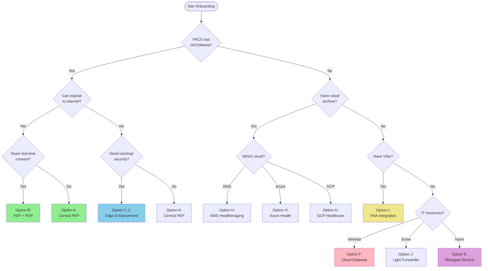
```mermaid
flowchart TD
    Start([Site Onboarding]) --> Check1{PACS has<br/>DICOMweb?}
    
    Check1 -->|Yes| Check2{Can expose<br/>to internet?}
    Check1 -->|No| Check3{Have cloud<br/>archive?}
    
    Check2 -->|Yes| Check4{Need real-time<br/>consent?}
    Check2 -->|No| Check5{Need caching/<br/>security?}
    
    Check4 -->|Yes| OptB[Option B:<br/>PEP + PDP]
    Check4 -->|No| OptA[Option A:<br/>Central PEP]
    
    Check5 -->|Yes| OptC1[Option C.1:<br/>Edge Enhancement]
    Check5 -->|No| OptA2[Option A:<br/>Central PEP]
    
    Check3 -->|Yes| Check6{Which cloud?}
    Check3 -->|No| Check7{Have VNA?}
    
    Check6 -->|AWS| OptH1[Option H:<br/>AWS HealthImaging]
    Check6 -->|Azure| OptH2[Option H:<br/>Azure Health]
    Check6 -->|GCP| OptH3[Option H:<br/>GCP Healthcare]
    
    Check7 -->|Yes| OptI[Option I:<br/>VNA Integration]
    Check7 -->|No| Check8{IT resources?}
    
    Check8 -->|Minimal| OptF[Option F:<br/>Cloud Gateway]
    Check8 -->|Some| OptJ[Option J:<br/>Light Forwarder]
    Check8 -->|None| OptE[Option E:<br/>Managed Service]
    
    style OptA fill:#90EE90
    style OptB fill:#90EE90
    style OptC1 fill:#87CEEB
    style OptF fill:#FFB6C1
    style OptE fill:#DDA0DD
    style OptI fill:#F0E68C
```

### Quick Selection Guide
```
┌─ Does your PACS have DICOMweb? ─┐
│                                  │
├─ YES ─────────────────────────┐  ├─ NO (DIMSE only) ─────────────┐
│                               │  │                                │
├─ Can expose to internet? ─┐   │  ├─ Do you have cloud archive? ─┐ │
│                           │   │  │                              │ │
├─ YES → Option A          │   │  ├─ YES → Option H/I           │ │
├─ NO → Option C.1         │   │  ├─ NO → Continue...           │ │
│                           │   │  │                              │ │
├─ Need real-time veto? ─┐  │   │  ├─ Can install software? ─┐   │ │
├─ YES → Option B        │  │   │  ├─ YES → Option C.2/J      │   │ │
└─ NO → Option A         │  │   │  ├─ NO → Option F/E         │   │ │
```

### Deployment Options by Complexity Level

#### Level 0: No Work Required (Use Existing Infrastructure)
- **Option H** — Site already has cloud archive with DICOMweb (AWS/Azure/GCP)
- **Option I** — Site already has VNA with DICOMweb enabled

#### Level 1: Configuration Only (<1 hour setup)
- **Option A** — Central PEP with Snapshot allow‑lists (DICOMweb-enabled PACS)
- **Option F** — Cloud DIMSE Gateway Service (DIMSE-only PACS, auto-forward configuration)

#### Level 2: Minimal Software (<1 day setup)  
- **Option B** — Central PEP + site‑hosted PDP (DICOMweb with real-time veto)
- **Option J** — Lightweight DIMSE Forwarder (minimal Docker container)
- **Option C.1** — Edge Connector for DICOMweb enhancement (security/caching)

#### Level 3: Moderate Complexity (<1 week setup)
- **Option C.2** — Edge Connector for DIMSE translation (full protocol bridge)
- **Option C.3** — Hybrid Edge Connector (both DICOMweb and DIMSE)
- **Option G** — Commercial vendor gateway integration

#### Level 4: Fully Managed Service
- **Option D** — Direct cloud front‑ends (Flywheel, AWS HealthImaging)
- **Option E** — RADIANT fully managed appliance service


## 4) Detailed Deployment Options

### DICOMweb-Native Options

**Option A — Central PEP with Snapshot allow‑lists (default/lowest lift)**  
Central gateway enforces cohort membership and proxies to the site's DICOMweb. Site exposes read‑only DICOMweb (QIDO/WADO) and maintains registries.
- **Requirements**: DICOMweb-enabled PACS, internet connectivity, IP allowlisting
- **Site work**: Configure firewall rules, provide endpoint URLs
- **Best for**: Modern PACS with native DICOMweb support

**Option B — Central PEP + site‑hosted PDP (real‑time veto)**  
Same as A, plus the PEP calls the site's PDP webhook (`/v1/authorize`) to confirm consent before proxying; DENY on timeout (configurable 5-30 seconds).
- **Requirements**: Everything from Option A + HTTPS endpoint for PDP
- **Site work**: Deploy simple webhook service (sample code provided)
- **Best for**: Sites requiring immediate consent enforcement

### Edge Connector Options (Multi-Purpose)

**Option C — On‑prem Edge Connector (Three Variants)**

**C.1 — Edge for DICOMweb Enhancement**
- **Use case**: PACS has DICOMweb but needs additional capabilities
- **Features**:
  - Local snapshot enforcement
  - Security hardening and mTLS termination
  - Response caching (100GB-10TB configurable)
  - Bandwidth optimization and compression
  - Audit aggregation before forwarding
- **Requirements**: 4 vCPU, 16GB RAM, 500GB SSD
- **Site work**: Deploy VM/container, configure PACS endpoint

**C.2 — Edge for DIMSE Translation**
- **Use case**: PACS only supports traditional DIMSE protocol
- **Features**:
  - Full DIMSE protocol support (C-ECHO, C-FIND, C-MOVE, C-STORE, C-GET)
  - DICOM SCP listener (port 104/11112)
  - Query/Retrieve SCU for PACS communication
  - Protocol translation: DIMSE ↔ DICOMweb mapping
  - Local cache for async C-STORE operations
  - Connection pooling for multiple associations
- **Requirements**: 
  - 8 vCPU, 32GB RAM, 1TB SSD
  - Static AE Title registration in PACS
  - Firewall rules for DICOM ports
  - Network connectivity to PACS (typically internal)
- **Site work**: Configure PACS routing table, register AE Titles

**C.3 — Hybrid Edge Connector**
- **Use case**: Mixed environment or migration scenario
- **Features**: Combines C.1 and C.2 capabilities
- **Requirements**: 8 vCPU, 32GB RAM, 1TB SSD
- **Best for**: Sites transitioning from DIMSE to DICOMweb

### Cloud-Based Options

**Option D — Direct cloud front‑ends (e.g., Flywheel, AWS HealthImaging)**  
The site publishes DICOMweb via a cloud platform; central PEP applies the same Snapshot/PDP rules and streams pixels from the cloud endpoint.
- **Requirements**: Existing cloud imaging deployment
- **Site work**: Provide API credentials to RADIANT
- **Best for**: Sites already using cloud PACS/VNA

**Option E — Fully Managed Service**  
RADIANT provides complete turnkey solution including:
- **Pre-configured edge appliance** (physical or virtual) with:
  - Automated VPN tunnel establishment to RADIANT cloud
  - Built-in DICOM-to-DICOMweb bridge
  - Local caching (100GB-10TB configurable)
  - Automatic software updates with rollback capability
- **Requirements for managed service**:
  - Network: 100Mbps+ dedicated bandwidth, static IP
  - Compute: 8 vCPU, 32GB RAM, 500GB SSD minimum
  - DICOM: C-ECHO accessibility to PACS/VNA
  - Access: Read-only DICOM Query/Retrieve permissions
  - Power: Redundant power supply or UPS recommended
- **24/7 remote monitoring and support**
- **Automated configuration management** via Ansible/Terraform
- **Zero-touch provisioning** with QR code activation
- **Site work**: Rack and connect appliance, scan QR code

### DIMSE-Specific Options

**Option F — Cloud DIMSE Gateway Service**
- **Use case**: DIMSE-only PACS with good internet connectivity
- **How it works**:
  - RADIANT provides cloud-hosted DIMSE receiver
  - Site configures PACS to auto-forward studies via C-STORE
  - Cloud gateway receives and caches DICOM objects
  - Cloud service provides DICOMweb access to RADIANT
  - Built-in snapshot enforcement
- **Requirements**:
  - Configure PACS auto-routing rules (one-time setup)
  - VPN or secure tunnel to RADIANT cloud (provided)
  - Sufficient WAN bandwidth for C-STORE operations
- **Site work**: Configure auto-forwarding rules in PACS (<1 hour)
- **Best for**: Small/medium sites without DICOMweb capability

**Option G — Commercial Vendor Gateway Solutions**
- **Use case**: Sites with existing vendor relationships
- **Supported gateways**:
  - Laurel Bridge Compass Router
  - Dicom Systems Unifier
  - Clario DICOM Gateway
  - Intelerad Odyssey
  - Change Healthcare Enterprise Archive
- **How it works**:
  - Configure PACS to send to vendor gateway via DIMSE
  - Vendor gateway exposes DICOMweb to RADIANT
  - RADIANT treats it like Option A (standard DICOMweb)
- **Site work**: Configure existing gateway (<1 day)
- **Best for**: Sites with enterprise imaging infrastructure

**Option H — Leverage Existing Cloud Archives**
- **Use case**: PACS already archives to cloud
- **Supported platforms**:
  - AWS HealthImaging
  - Google Cloud Healthcare API
  - Azure Health Data Services
  - Microsoft Cloud for Healthcare
- **Site work**: Provide RADIANT with access credentials
- **Best for**: Sites with existing cloud infrastructure

**Option I — VNA-Based Integration**
- **Use case**: Sites with Vendor Neutral Archive
- **How it works**:
  - PACS sends to VNA via DIMSE (often already configured)
  - VNA exposes DICOMweb endpoints
  - RADIANT connects to VNA's DICOMweb interface
- **Supported VNAs**:
  - Acuo Technologies
  - Fujifilm Synapse VNA
  - Change Healthcare VNA
  - Sectra VNA
  - AGFA Enterprise Imaging
- **Site work**: Enable DICOMweb on VNA, provide endpoints
- **Best for**: Large health systems with VNA infrastructure

**Option J — Lightweight DIMSE Forwarder**
- **Use case**: Minimal footprint DIMSE support
- **Features**:
  - Ultra-light Docker container (<100MB)
  - C-STORE forwarding only (no local storage)
  - Auto-streams to RADIANT cloud
  - Self-updating with automatic rollback
- **Requirements**:
  - Any Linux box or VM with 2GB RAM
  - Docker or Podman runtime
  - Network connectivity to PACS and internet
- **Site work**: Deploy container, configure PACS forwarding
- **Best for**: Resource-constrained sites needing simple solution


## 5) Data contracts & reference calls

**Bulk FHIR (discovery)**  
```
GET {FHIR_BASE}/Group/{AllPatients}/$export?_type=ImagingStudy,DiagnosticReport,ServiceRequest,Endpoint
Accept: application/fhir+json
Prefer: respond-async
Authorization: Bearer {JWT}
X-API-Version: v1.0  # API versioning header
```

**DICOMweb (retrieval with enhanced error handling)**  
```
# Query series (QIDO‑RS)
GET {QIDO_BASE}/studies/{StudyUID}/series
Accept: application/dicom+json
X-API-Version: v1.0

# Retrieve native instance with resume support (WADO‑RS)
GET {WADO_BASE}/studies/{StudyUID}/series/{SeriesUID}/instances/{SOPUID}
Accept: application/dicom
Range: bytes=1048576-2097152  # Support for partial retrieval
X-Checksum-SHA256: {expected_hash}  # Integrity verification
X-Priority: routine|urgent|emergency  # Request prioritization
X-API-Version: v1.0

# Retrieve study metadata (no pixels)
GET {WADO_BASE}/studies/{StudyUID}/metadata
Accept: application/dicom+json
X-API-Version: v1.0
```

**DIMSE Configuration (for Options C.2, F, G, J)**
```json
{
  "dimseConfiguration": {
    "localAeTitle": "RADIANT_EDGE_01",
    "localPort": 11112,
    "pacsConnections": [{
      "remoteAeTitle": "SITE_PACS",
      "hostname": "10.0.0.100",
      "port": 104,
      "timeout": 30000,
      "maxAssociations": 10,
      "retrieveMethod": "C-MOVE",  // or "C-GET" if supported
      "transferSyntaxes": [
        "1.2.840.10008.1.2",      // Implicit VR Little Endian
        "1.2.840.10008.1.2.1",    // Explicit VR Little Endian
        "1.2.840.10008.1.2.4.70", // JPEG Lossless
        "1.2.840.10008.1.2.4.50"  // JPEG Baseline
      ],
      "queryRetrieveModel": "STUDY",
      "storageCommitment": false
    }],
    "cStoreCache": {
      "maxSizeMB": 102400,
      "ttlMinutes": 60,
      "compressionEnabled": true
    },
    "associationNegotiation": {
      "maxPduSize": 16384,
      "implementationClassUID": "1.2.826.0.1.3680043.10.854",
      "implementationVersionName": "RADIANT_2.0"
    }
  }
}
```


## 6) Security, consent gating, and identity

- **Consent boundary**: EHR registry mapping (External Client ID → Authorized Group) hard‑gates $export to only enrolled patients; imaging retrieval inherits this boundary via Snapshot/PDP.  
- **Enhanced Transport & Auth**: 
  - **MANDATORY mTLS for production**: All production deployments MUST use mutual TLS 1.3+
  - **Requirements for mTLS implementation**:
    - Certificate pinning for known endpoints
    - Hardware Security Module (HSM) for private key storage
    - Certificate rotation every 90 days with 30-day overlap
    - OCSP stapling for real-time certificate validation
  - **Additional authentication layers**:
    - OAuth 2.0 with JWT Bearer tokens (RS256 minimum)
    - API key rotation every 30 days
    - Rate limiting by client certificate fingerprint
    - Geo-fencing based on certificate attributes
  - **DIMSE-specific security**:
    - AE Title allowlisting with regular expression matching
    - Called/Calling AE Title validation
    - IP-based access control for DICOM associations
    - TLS wrapper for DICOM (when supported by PACS)
  - Per‑site scopes and IP allow‑lists remain as additional defense
  - Audit all authentication attempts with threat scoring
- **Revocation**: Snapshot refresh SLA (e.g., ≤24h) + PDP for immediate deny (≤5 min).


## 7) SLOs, dashboards, and disaster recovery

**Service Level Objectives**
- Consent freshness: revocation → enforced deny within **≤24h** via snapshot; **≤5 min** with PDP.  
- Bulk FHIR timeliness: All‑Patients (delta) within **≤24h**; New‑Patients (heavy) within **≤48h**.  
- DICOMweb reliability: WADO success **≥99.5%**/site (30‑day); P95 **≤15 s**, P99 **≤60 s** per instance.  
- DIMSE reliability: C-STORE success **≥99%**/site; C-MOVE completion **≥98%** for available studies.
- Audit availability: near real‑time console (≤5 min lag) + daily CSV by 08:00 local.
- **API availability**: 99.9% uptime for all versioned APIs with <100ms response for health checks
- **Recovery objectives**: RTO ≤ 4 hours, RPO ≤ 1 hour for critical services

**Dashboards with Enhanced Observability**
- Cohort & consent: snapshot freshness, cohort size, revocations, PDP allow/deny/timeout, time‑to‑deny.  
- Bulk FHIR health: run success %, backlog, per‑site duration, error mix.  
- DICOMweb health: success %, P95/P99, 429 rate, bytes/day, open streams.  
- **DIMSE metrics**: Association success rate, C-STORE/C-MOVE statistics, transfer syntax negotiation failures, timeout distribution.
- Storage & cost: hot/warm/cold TB, dedupe ratio, egress vs budget.  
- Onboarding flow: sites by stage, time‑to‑go‑live, golden tests pass/fail; incident MTTR.
- **New observability metrics**:
  - Request tracing with correlation IDs across all hops
  - Circuit breaker status per site/endpoint
  - Automatic anomaly alerts via PagerDuty/Opsgenie
  - SLO burn rate monitoring with proactive alerting
  - Capacity planning projections based on growth trends
  - Protocol distribution (DICOMweb vs DIMSE percentage)

**Disaster Recovery Architecture**
- **Primary/Secondary PEP Configuration**:
  - Active-active PEP gateways in different availability zones
  - Automatic failover via health checks every 10 seconds
  - Session affinity maintained during failover
  - DIMSE association state replication for seamless failover
- **Backup Strategy**:
  - Real-time replication of Trust Registry to 3 geographic regions
  - Snapshot data replicated to secondary region within 5 minutes
  - Audit logs streamed to immutable storage in real-time
  - DIMSE forwarding queue persistence with automatic replay
- **Failover Procedures**:
  - Automated failover for PEP/Gateway components (<30 seconds)
  - Manual failover for Bulk FHIR scheduler with playbook (<15 minutes)
  - DIMSE association migration with graceful connection draining
  - Regular failover testing every quarter with reports
- **Data Recovery**:
  - Point-in-time recovery for all configuration data (5-minute granularity)
  - Snapshot reconstruction from source NDJSON if needed
  - Audit log retention for 7 years in cold storage
  - DIMSE transaction replay from persistent queue


## 8) Onboarding & validation (per site)

### Universal Requirements (All Options)
- Create/maintain **All Patients** + **New Patients** registries in EHR
- Map Central Hub's Backend Client ID to authorized registries
- Schedule daily Bulk FHIR updates

### Option-Specific Requirements

**DICOMweb Options (A, B, D, H, I)**
- Expose DICOMweb base URLs
- Allow‑list central gateway IPs
- Enable **mTLS** (mandatory for production)
- Run DICOMweb golden tests

**DIMSE Options (C.2, F, G, J)**
- Register RADIANT AE Titles in PACS
- Configure auto-forwarding rules or query/retrieve permissions
- Test DICOM associations (C-ECHO)
- Validate transfer syntax support
- Run DIMSE golden tests (C-STORE, C-MOVE)

**Edge Connector Options (C.1, C.2, C.3, E)**
- Deploy VM/container or physical appliance
- Configure network connectivity
- Install certificates
- Run end-to-end tests

### Golden Test Suite
- **Consent tests**: enrolled vs non‑enrolled $export
- **DICOMweb tests**: two small + one large WADO
- **DIMSE tests**: C-ECHO, C-STORE, C-MOVE validation
- **Revocation tests**: immediate deny w/ PDP; deny at next snapshot refresh
- **Audit tests**: reconciliation across all protocols
- **Error tests**: 401/403/404/429 handling
- **Automated testing requirements**:
  - Continuous synthetic transactions every 5 minutes
  - Automated regression testing for all API versions
  - Load testing to validate throughput limits
  - Chaos engineering tests monthly


## 9) Gateway & vendor options (fit‑for‑purpose)

**Streaming reverse proxies (PEP/edge):** *Envoy* (ext_authz, strong rate limiting), *NGINX/NGINX Plus* (Lua/njs policy), *HAProxy* (ACLs/Lua).  
**API‑management suites:** *MuleSoft* (Anypoint + Flex Gateway for streaming PEP), *Apigee X*, *Azure API Management*, *AWS API Gateway* (use a separate streaming proxy for large WADO).  
**Open‑source gateways:** *Kong*, *APISIX*, *Tyk*, *Traefik*, *KrakenD* (confirm non‑buffered streaming & timeouts).  
**Integration engines & companions:** *Lyniate Rhapsody* (PDP webhook, accession/event feeders, audit concentrator), *Orthanc/dcm4che* (C‑MOVE→WADO bridge).  
**DIMSE-to-DICOMweb bridges:** *Orthanc* (open-source), *dcm4chee* (open-source), *Laurel Bridge Compass*, *Dicom Systems Unifier*.
**Commercial PACS gateways:** Multi‑vendor **bidirectional** gateways auto‑forward to a VNA **holding‑pen** for QC/normalization; proven for cross‑network exchange.


## 10) Health‑system archetypes → recommended paths

- **Large IDN/AMC**: 
  - Primary: Option C.3 (Hybrid Edge) for maximum control
  - Alternative: Option G (Commercial Gateway) if already deployed
  - Add PDP + event feeders for real-time control
  
- **Mid‑size regional**: 
  - DICOMweb-capable: Option A (Central PEP)
  - DIMSE-only: Option F (Cloud Gateway) or Option J (Lightweight Forwarder)
  - Consider Option I if VNA present
  
- **Small/community**: 
  - Minimal IT: Option E (Managed Service)
  - DICOMweb PACS: Option A (Central PEP)
  - DIMSE PACS: Option F (Cloud Gateway) or Option J (Lightweight Forwarder)
  - Existing cloud: Option H (leverage existing)

- **Academic/Research**: 
  - Option C.2 or C.3 for full protocol support
  - Option B for granular consent control
  - Multiple options for different departments


## 11) Error taxonomy, adaptive throughput, and circuit breakers

**Retryable taxonomy with enhanced recovery**  
- 401/403 re‑auth with token refresh
- 404 UID drift (re‑QIDO with backtrack to last known good state)
- 409 IOCM conflict with automatic resolution attempt
- **429** honor `Retry‑After` + exponential back‑off with jitter (configurable base: 1-30s)
- 5xx back‑off & alert with circuit breaker activation
- **Network errors**: Automatic resume from last successful byte offset
- **Checksum failures**: Automatic retry with different route if available
- **DIMSE-specific errors**:
  - 0xA700 (Out of Resources) — reduce association count
  - 0xA900 (Dataset mismatch) — verify UIDs and retry
  - 0xC000 (Cannot process) — exponential backoff
  - Association timeout — retry with increased timeout
  - Transfer syntax failure — fallback to uncompressed

**Throughput governor with circuit breakers**  
- Per‑site token buckets with adaptive sizing based on success rate
- **Circuit breaker implementation**:
  - Open circuit after 5 consecutive failures or 50% failure rate over 10 requests
  - Half-open state after configurable cool-down (default: 60 seconds)
  - Gradual recovery with single test request before full reopening
  - Cascade prevention across dependent services
  - DIMSE-specific: Track association failures separately
- **Request prioritization**:
  - Three queues: emergency (immediate), urgent (≤5 min), routine (best effort)
  - Emergency requests bypass rate limits but are logged
  - Dynamic priority elevation based on wait time
  - DIMSE priority via different AE Titles or ports
- Fairness algorithm with anti-starvation guarantees
- Real-time throughput adjustment based on latency percentiles

**PDP Configuration Options**
- **Timeout values** (configurable per site):
  - Default: 5 seconds
  - Range: 1-30 seconds
  - Emergency requests: 1 second hard limit
  - DIMSE operations: Extended timeout for C-MOVE (up to 300 seconds)
- **Retry policy**: 
  - Standard requests: 3 retries with exponential backoff
  - Emergency: No retry, immediate fallback to snapshot-only
  - DIMSE: Configurable retries per operation type


## 12) USCDI & standards alignment with versioning

- FHIR **ImagingStudy** carries identifiers (Study/Series/SOP UIDs) and **Endpoint** pointers; `connectionType = dicom‑wado‑rs` signals a DICOMweb WADO‑RS base URL usable for HTTP GET retrieval. While FHIR provides metadata and links, **pixels flow via DICOMweb** (QIDO/WADO) or **DIMSE** protocols.  
- As national data classes add **Imaging Reference** and **Accession Number** linkages, this blueprint already aligns by using **ImagingStudy + Endpoint** and WADO‑RS for actual delivery.  
- **Protocol bridging**: DIMSE-retrieved studies are exposed via DICOMweb interface to maintain API consistency.
- **API Versioning Strategy**:
  - Semantic versioning (MAJOR.MINOR.PATCH) for all APIs
  - Version negotiation via Accept headers and URL paths
  - Backward compatibility guaranteed for 24 months
  - Deprecation notices 12 months in advance
  - Version sunset with automated migration tools
  - Protocol-agnostic versioning (same API version for DICOMweb and DIMSE paths)


## 13) Glossary
- **DICOMweb**: Web‑native DICOM services — QIDO‑RS (query), WADO‑RS (retrieve), STOW‑RS (store).  
- **DIMSE**: DICOM Message Service Element — traditional DICOM network protocol (C-ECHO, C-FIND, C-MOVE, C-STORE, C-GET).
- **PEP/PDP**: Policy enforcement point / decision point.  
- **CSS**: Cohort Snapshot Service. **TR**: Trust Registry. **EMPI**: Enterprise Master Patient Index. **IOCM**: Imaging Object Change Management.  
- **WADO/QIDO/STOW**: Web Access to DICOM Objects / Query based on ID for DICOM Objects / Store Over the Web.
- **CDC**: Change Data Capture for real-time event streaming
- **Circuit Breaker**: Fault tolerance pattern preventing cascade failures
- **mTLS**: Mutual Transport Layer Security for bidirectional authentication
- **AE Title**: Application Entity Title — unique identifier for DICOM applications
- **SCP/SCU**: Service Class Provider (server) / Service Class User (client) in DICOM
- **VNA**: Vendor Neutral Archive — standards-based medical imaging repository
- **Transfer Syntax**: DICOM encoding rules for pixel data (compressed/uncompressed)
- **Association**: DICOM network connection between two Application Entities


## Appendix A — Core Sequence Diagrams

**S0 — Cohort Snapshot build (Bulk FHIR discovery)**
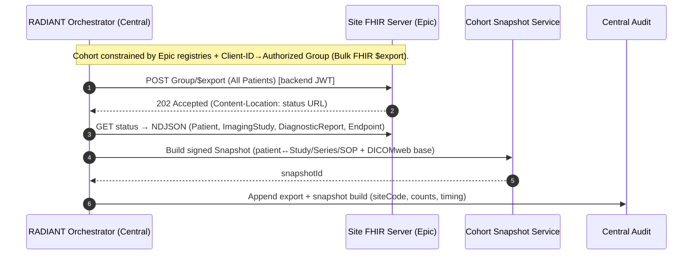
```mermaid
sequenceDiagram
  autonumber
  participant HUB as RADIANT Orchestrator (Central)
  participant EHR as Site FHIR Server (Epic)
  participant CSS as Cohort Snapshot Service
  participant AUD as Central Audit

  Note over HUB,EHR: Cohort constrained by Epic registries + Client-ID→Authorized Group (Bulk FHIR $export).
  HUB->>EHR: POST Group/$export (All Patients) [backend JWT]
  EHR-->>HUB: 202 Accepted (Content-Location: status URL)
  HUB->>EHR: GET status → NDJSON (Patient, ImagingStudy, DiagnosticReport, Endpoint)
  HUB->>CSS: Build signed Snapshot (patient↔Study/Series/SOP + DICOMweb base)
  CSS-->>HUB: snapshotId
  HUB->>AUD: Append export + snapshot build (siteCode, counts, timing)
```

**S1 — Central PEP → Site DICOMweb, optional site PDP**
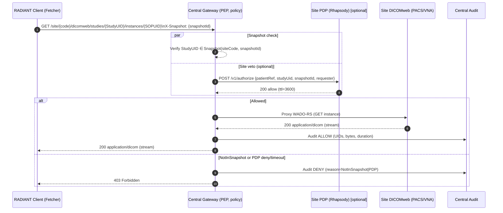
```mermaid
sequenceDiagram
  autonumber
  participant HUB as RADIANT Client (Fetcher)
  participant PEP as Central Gateway (PEP, policy)
  participant PDP as Site PDP (Rhapsody) [optional]
  participant PACS as Site DICOMweb (PACS/VNA)
  participant AUD as Central Audit

  HUB->>PEP: GET /site/{code}/dicomweb/studies/{StudyUID}/instances/{SOPUID}\nX-Snapshot: {snapshotId}
  par Snapshot check
    PEP-->>PEP: Verify StudyUID ∈ Snapshot(siteCode, snapshotId)
  and Site veto (optional)
    PEP->>PDP: POST /v1/authorize {patientRef, studyUid, snapshotId, requester}
    PDP-->>PEP: 200 allow (ttl=3600)
  end
  alt Allowed
    PEP->>PACS: Proxy WADO-RS (GET instance)
    PACS-->>PEP: 200 application/dicom (stream)
    PEP->>AUD: Audit ALLOW (UIDs, bytes, duration)
    PEP-->>HUB: 200 application/dicom (stream)
  else NotInSnapshot or PDP deny/timeout
    PEP->>AUD: Audit DENY (reason=NotInSnapshot|PDP)
    PEP-->>HUB: 403 Forbidden
  end
```

**S2 — DIMSE Edge Connector Protocol Translation**
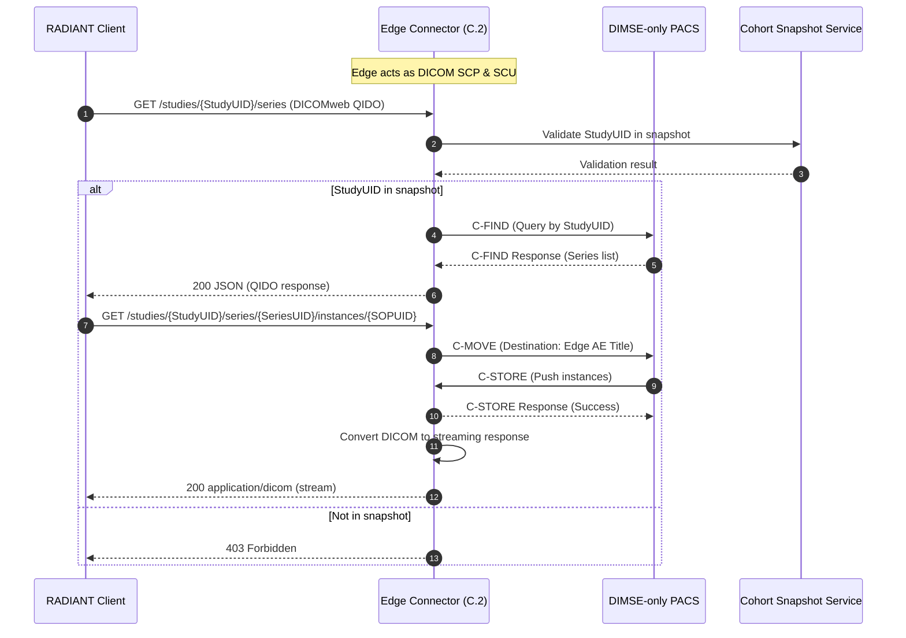
```mermaid
sequenceDiagram
  autonumber
  participant Client as RADIANT Client
  participant Edge as Edge Connector (C.2)
  participant PACS as DIMSE-only PACS
  participant CSS as Cohort Snapshot Service
  
  Note over Edge: Edge acts as DICOM SCP & SCU
  
  Client->>Edge: GET /studies/{StudyUID}/series (DICOMweb QIDO)
  Edge->>CSS: Validate StudyUID in snapshot
  CSS-->>Edge: Validation result
  
  alt StudyUID in snapshot
    Edge->>PACS: C-FIND (Query by StudyUID)
    PACS-->>Edge: C-FIND Response (Series list)
    Edge-->>Client: 200 JSON (QIDO response)
    
    Client->>Edge: GET /studies/{StudyUID}/series/{SeriesUID}/instances/{SOPUID}
    Edge->>PACS: C-MOVE (Destination: Edge AE Title)
    PACS->>Edge: C-STORE (Push instances)
    Edge-->>PACS: C-STORE Response (Success)
    Edge->>Edge: Convert DICOM to streaming response
    Edge-->>Client: 200 application/dicom (stream)
  else Not in snapshot
    Edge-->>Client: 403 Forbidden
  end
```

**S3 — Cloud DIMSE Gateway (Option F)**
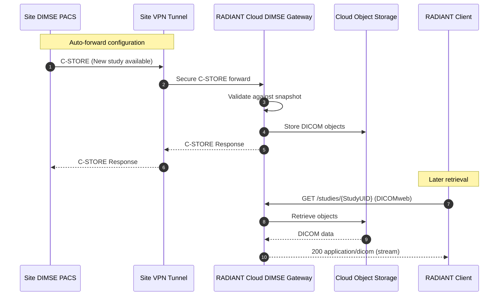
```mermaid
sequenceDiagram
  autonumber
  participant PACS as Site DIMSE PACS
  participant VPN as Site VPN Tunnel
  participant CloudGW as RADIANT Cloud DIMSE Gateway
  participant Storage as Cloud Object Storage
  participant Client as RADIANT Client
  
  Note over PACS,VPN: Auto-forward configuration
  
  PACS->>VPN: C-STORE (New study available)
  VPN->>CloudGW: Secure C-STORE forward
  CloudGW->>CloudGW: Validate against snapshot
  CloudGW->>Storage: Store DICOM objects
  CloudGW-->>VPN: C-STORE Response
  VPN-->>PACS: C-STORE Response
  
  Note over Client: Later retrieval
  
  Client->>CloudGW: GET /studies/{StudyUID} (DICOMweb)
  CloudGW->>Storage: Retrieve objects
  Storage-->>CloudGW: DICOM data
  CloudGW-->>Client: 200 application/dicom (stream)
```

**S4 — Lightweight DIMSE Forwarder (Option J)**
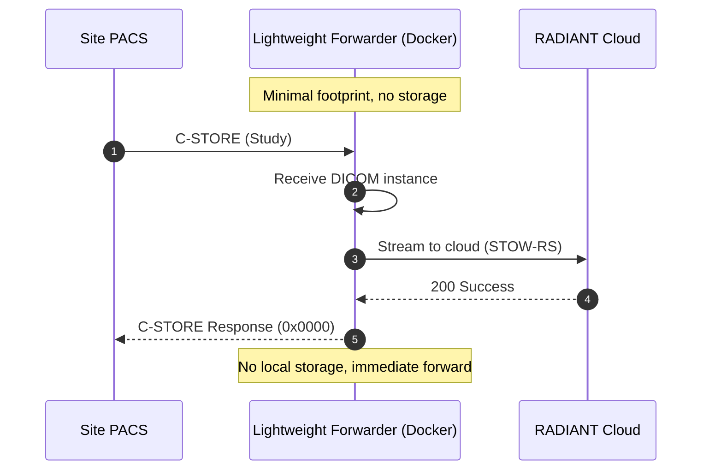
```mermaid
sequenceDiagram
  autonumber
  participant PACS as Site PACS
  participant Forwarder as Lightweight Forwarder (Docker)
  participant Cloud as RADIANT Cloud
  
  Note over Forwarder: Minimal footprint, no storage
  
  PACS->>Forwarder: C-STORE (Study)
  Forwarder->>Forwarder: Receive DICOM instance
  Forwarder->>Cloud: Stream to cloud (STOW-RS)
  Cloud-->>Forwarder: 200 Success
  Forwarder-->>PACS: C-STORE Response (0x0000)
  
  Note over Forwarder: No local storage, immediate forward
```

**S5 — VNA Integration (Option I)**
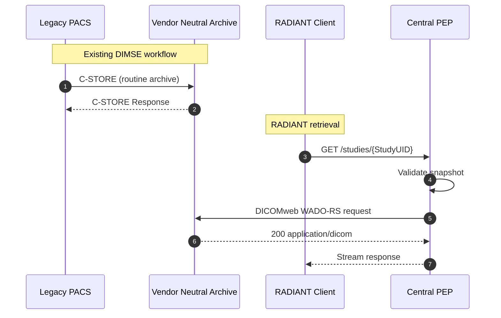
```mermaid
sequenceDiagram
  autonumber
  participant PACS as Legacy PACS
  participant VNA as Vendor Neutral Archive
  participant Client as RADIANT Client
  participant PEP as Central PEP
  
  Note over PACS,VNA: Existing DIMSE workflow
  
  PACS->>VNA: C-STORE (routine archive)
  VNA-->>PACS: C-STORE Response
  
  Note over Client: RADIANT retrieval
  
  Client->>PEP: GET /studies/{StudyUID}
  PEP->>PEP: Validate snapshot
  PEP->>VNA: DICOMweb WADO-RS request
  VNA-->>PEP: 200 application/dicom
  PEP-->>Client: Stream response
```

**S6 — Hybrid Edge Supporting Both Protocols (Option C.3)**
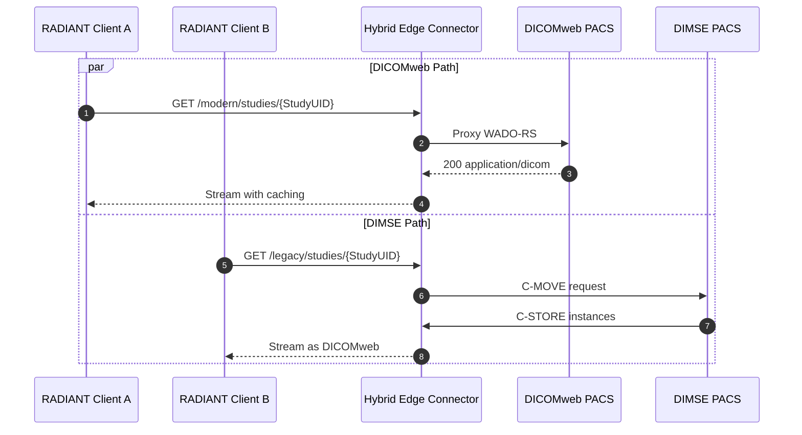
```mermaid
sequenceDiagram
  autonumber
  participant ClientA as RADIANT Client A
  participant ClientB as RADIANT Client B
  participant Edge as Hybrid Edge Connector
  participant ModernPACS as DICOMweb PACS
  participant LegacyPACS as DIMSE PACS
  
  par DICOMweb Path
    ClientA->>Edge: GET /modern/studies/{StudyUID}
    Edge->>ModernPACS: Proxy WADO-RS
    ModernPACS-->>Edge: 200 application/dicom
    Edge-->>ClientA: Stream with caching
  and DIMSE Path
    ClientB->>Edge: GET /legacy/studies/{StudyUID}
    Edge->>LegacyPACS: C-MOVE request
    LegacyPACS->>Edge: C-STORE instances
    Edge-->>ClientB: Stream as DICOMweb
  end
```

**S7 — Managed Service Activation (Option E)**
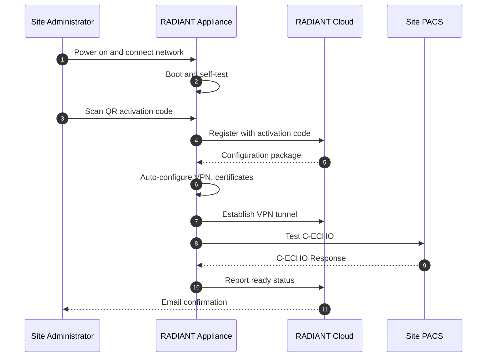
```mermaid
sequenceDiagram
  autonumber
  participant Admin as Site Administrator
  participant Appliance as RADIANT Appliance
  participant Cloud as RADIANT Cloud
  participant PACS as Site PACS
  
  Admin->>Appliance: Power on and connect network
  Appliance->>Appliance: Boot and self-test
  Admin->>Appliance: Scan QR activation code
  Appliance->>Cloud: Register with activation code
  Cloud-->>Appliance: Configuration package
  Appliance->>Appliance: Auto-configure VPN, certificates
  Appliance->>Cloud: Establish VPN tunnel
  Appliance->>PACS: Test C-ECHO
  PACS-->>Appliance: C-ECHO Response
  Appliance->>Cloud: Report ready status
  Cloud-->>Admin: Email confirmation
```

**S8 — Circuit Breaker with DIMSE Handling**
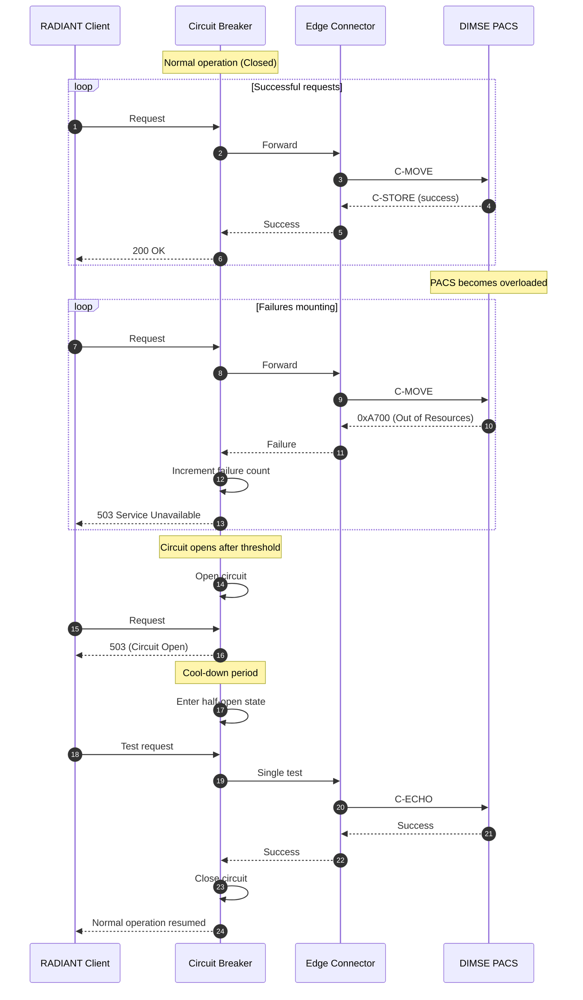
```mermaid
sequenceDiagram
  autonumber
  participant Client as RADIANT Client
  participant CB as Circuit Breaker
  participant Edge as Edge Connector
  participant PACS as DIMSE PACS
  
  Note over CB: Normal operation (Closed)
  
  loop Successful requests
    Client->>CB: Request
    CB->>Edge: Forward
    Edge->>PACS: C-MOVE
    PACS-->>Edge: C-STORE (success)
    Edge-->>CB: Success
    CB-->>Client: 200 OK
  end
  
  Note over PACS: PACS becomes overloaded
  
  loop Failures mounting
    Client->>CB: Request
    CB->>Edge: Forward
    Edge->>PACS: C-MOVE
    PACS-->>Edge: 0xA700 (Out of Resources)
    Edge-->>CB: Failure
    CB->>CB: Increment failure count
    CB-->>Client: 503 Service Unavailable
  end
  
  Note over CB: Circuit opens after threshold
  
  CB->>CB: Open circuit
  Client->>CB: Request
  CB-->>Client: 503 (Circuit Open)
  
  Note over CB: Cool-down period
  
  CB->>CB: Enter half-open state
  Client->>CB: Test request
  CB->>Edge: Single test
  Edge->>PACS: C-ECHO
  PACS-->>Edge: Success
  Edge-->>CB: Success
  CB->>CB: Close circuit
  CB-->>Client: Normal operation resumed
```

**S9 — Disaster Recovery with DIMSE State**
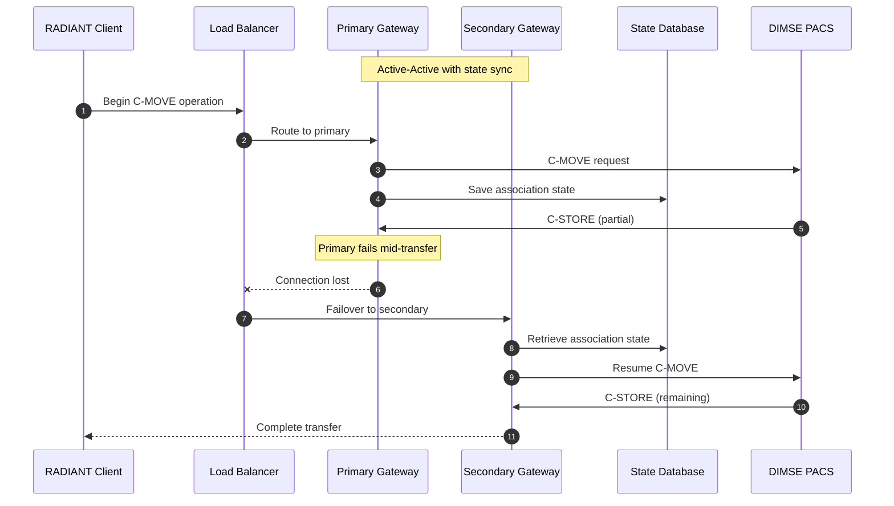
```mermaid
sequenceDiagram
  autonumber
  participant Client as RADIANT Client
  participant LB as Load Balancer
  participant Primary as Primary Gateway
  participant Secondary as Secondary Gateway
  participant StateDB as State Database
  participant PACS as DIMSE PACS
  
  Note over Primary,Secondary: Active-Active with state sync
  
  Client->>LB: Begin C-MOVE operation
  LB->>Primary: Route to primary
  Primary->>PACS: C-MOVE request
  Primary->>StateDB: Save association state
  PACS->>Primary: C-STORE (partial)
  
  Note over Primary: Primary fails mid-transfer
  
  Primary--xLB: Connection lost
  LB->>Secondary: Failover to secondary
  Secondary->>StateDB: Retrieve association state
  Secondary->>PACS: Resume C-MOVE
  PACS->>Secondary: C-STORE (remaining)
  Secondary-->>Client: Complete transfer
```


## Appendix A.2 — Protocol-Specific Workflows

**S10 — Option C.1: Edge for DICOMweb Enhancement (Security/Caching)**
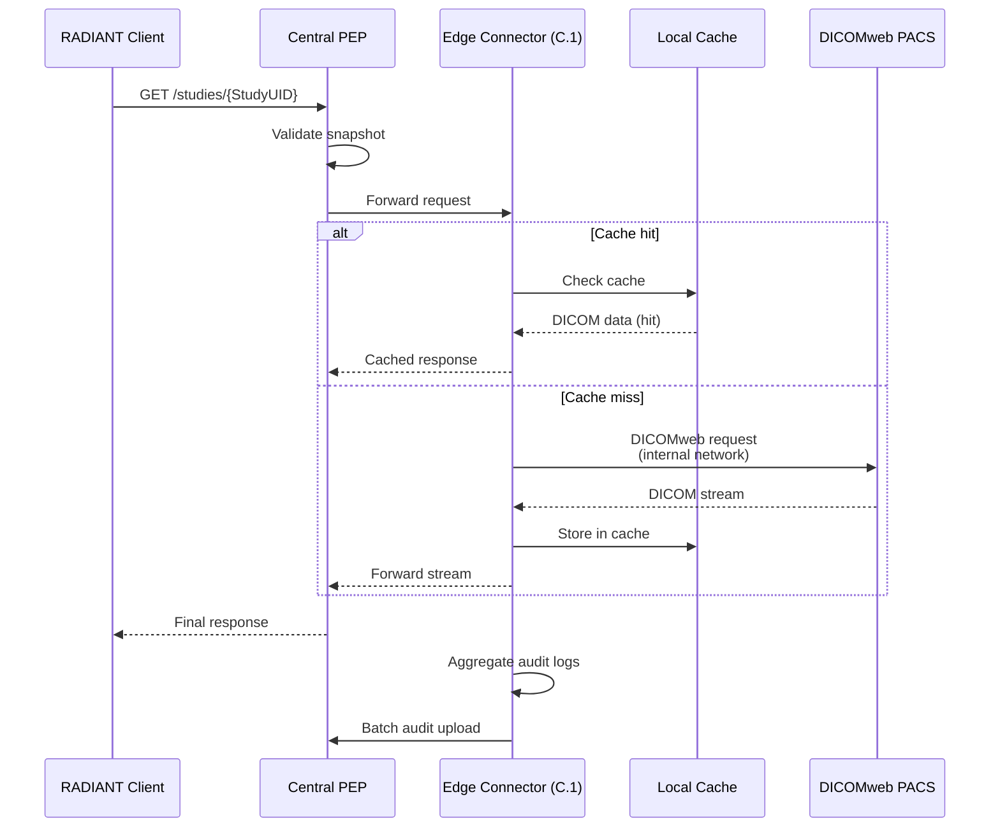
```mermaid
sequenceDiagram
  participant Client as RADIANT Client
  participant PEP as Central PEP
  participant Edge as Edge Connector (C.1)
  participant Cache as Local Cache
  participant PACS as DICOMweb PACS
  
  Client->>PEP: GET /studies/{StudyUID}
  PEP->>PEP: Validate snapshot
  PEP->>Edge: Forward request
  
  alt Cache hit
    Edge->>Cache: Check cache
    Cache-->>Edge: DICOM data (hit)
    Edge-->>PEP: Cached response
  else Cache miss
    Edge->>PACS: DICOMweb request<br/>(internal network)
    PACS-->>Edge: DICOM stream
    Edge->>Cache: Store in cache
    Edge-->>PEP: Forward stream
  end
  
  PEP-->>Client: Final response
  Edge->>Edge: Aggregate audit logs
  Edge->>PEP: Batch audit upload
```

**S11 — Option G: Commercial Vendor Gateway Integration**
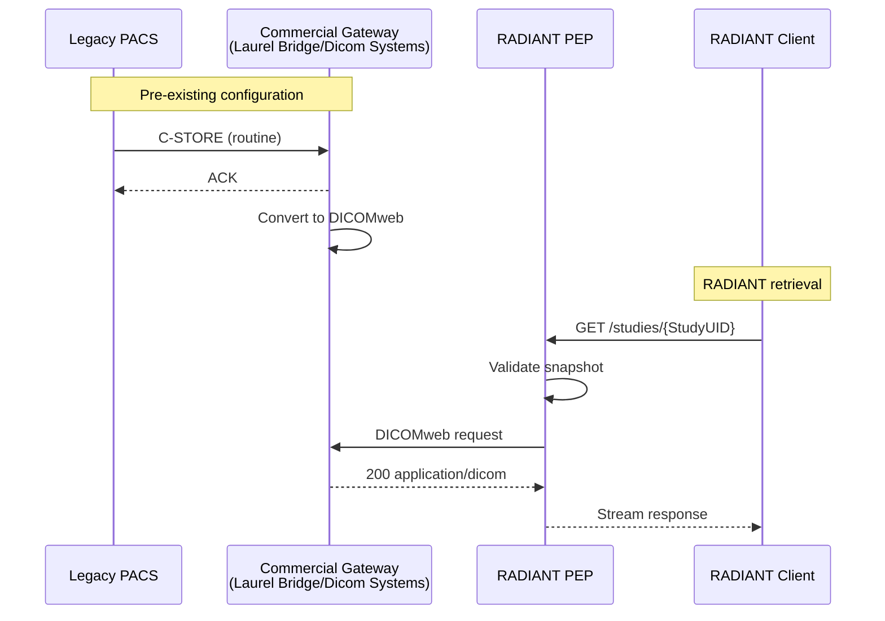
```mermaid
sequenceDiagram
  participant PACS as Legacy PACS
  participant VendorGW as Commercial Gateway<br/>(Laurel Bridge/Dicom Systems)
  participant PEP as RADIANT PEP
  participant Client as RADIANT Client
  
  Note over PACS,VendorGW: Pre-existing configuration
  
  PACS->>VendorGW: C-STORE (routine)
  VendorGW-->>PACS: ACK
  VendorGW->>VendorGW: Convert to DICOMweb
  
  Note over Client: RADIANT retrieval
  
  Client->>PEP: GET /studies/{StudyUID}
  PEP->>PEP: Validate snapshot
  PEP->>VendorGW: DICOMweb request
  VendorGW-->>PEP: 200 application/dicom
  PEP-->>Client: Stream response
```

**S12 — Option H: Existing Cloud Archive Integration**
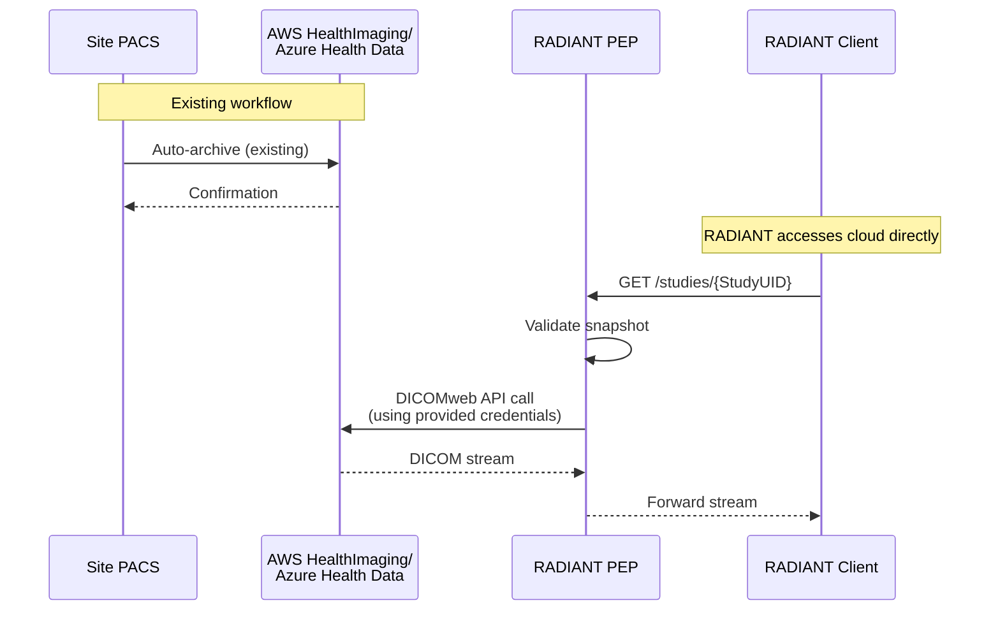
```mermaid
sequenceDiagram
  participant PACS as Site PACS
  participant CloudArchive as AWS HealthImaging/<br/>Azure Health Data
  participant PEP as RADIANT PEP
  participant Client as RADIANT Client
  
  Note over PACS,CloudArchive: Existing workflow
  
  PACS->>CloudArchive: Auto-archive (existing)
  CloudArchive-->>PACS: Confirmation
  
  Note over Client: RADIANT accesses cloud directly
  
  Client->>PEP: GET /studies/{StudyUID}
  PEP->>PEP: Validate snapshot
  PEP->>CloudArchive: DICOMweb API call<br/>(using provided credentials)
  CloudArchive-->>PEP: DICOM stream
  PEP-->>Client: Forward stream
```

**S13 — Multi-Site Federated Query**
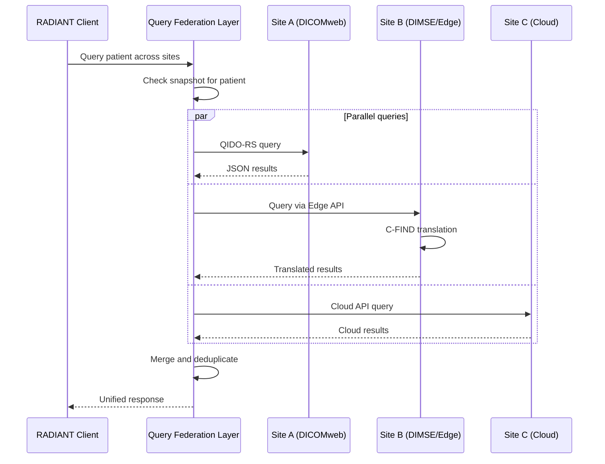
```mermaid
sequenceDiagram
  participant Client as RADIANT Client
  participant Federation as Query Federation Layer
  participant SiteA as Site A (DICOMweb)
  participant SiteB as Site B (DIMSE/Edge)
  participant SiteC as Site C (Cloud)
  
  Client->>Federation: Query patient across sites
  Federation->>Federation: Check snapshot for patient
  
  par Parallel queries
    Federation->>SiteA: QIDO-RS query
    SiteA-->>Federation: JSON results
  and
    Federation->>SiteB: Query via Edge API
    SiteB->>SiteB: C-FIND translation
    SiteB-->>Federation: Translated results
  and
    Federation->>SiteC: Cloud API query
    SiteC-->>Federation: Cloud results
  end
  
  Federation->>Federation: Merge and deduplicate
  Federation-->>Client: Unified response
```

**S14 — DIMSE Auto-Forward with Failure Recovery**
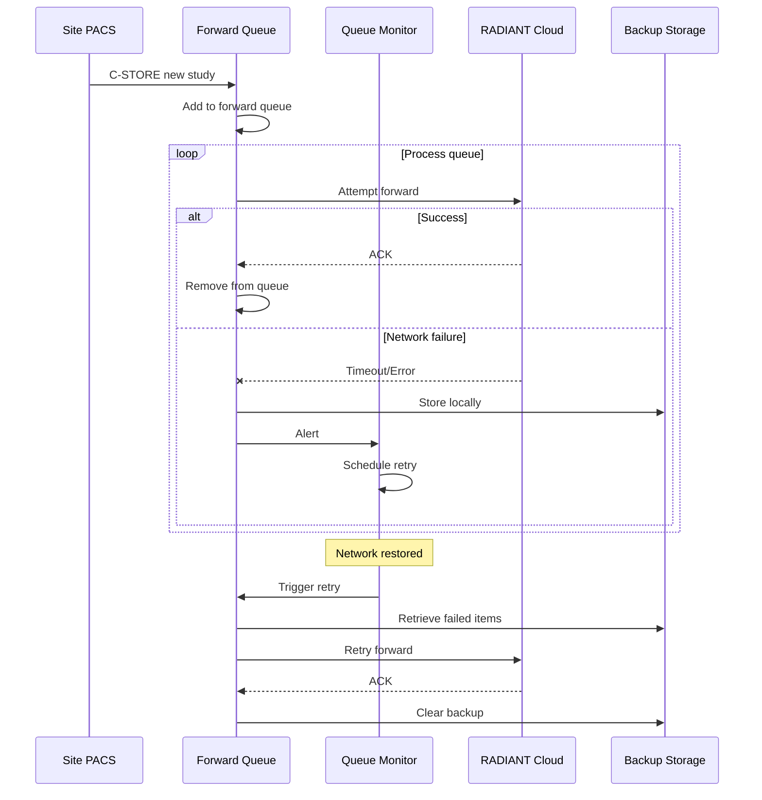
```mermaid
sequenceDiagram
  participant PACS as Site PACS
  participant Queue as Forward Queue
  participant Monitor as Queue Monitor
  participant Cloud as RADIANT Cloud
  participant Backup as Backup Storage
  
  PACS->>Queue: C-STORE new study
  Queue->>Queue: Add to forward queue
  
  loop Process queue
    Queue->>Cloud: Attempt forward
    alt Success
      Cloud-->>Queue: ACK
      Queue->>Queue: Remove from queue
    else Network failure
      Cloud--xQueue: Timeout/Error
      Queue->>Backup: Store locally
      Queue->>Monitor: Alert
      Monitor->>Monitor: Schedule retry
    end
  end
  
  Note over Monitor: Network restored
  
  Monitor->>Queue: Trigger retry
  Queue->>Backup: Retrieve failed items
  Queue->>Cloud: Retry forward
  Cloud-->>Queue: ACK
  Queue->>Backup: Clear backup
```

**S15 — Bandwidth Optimization for DIMSE Sites**
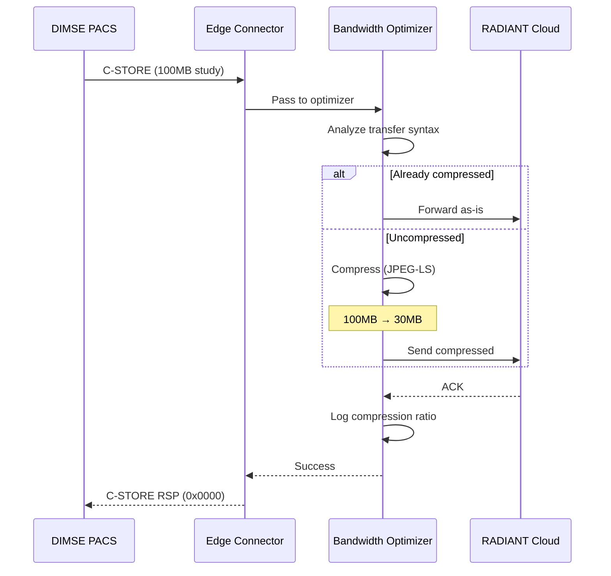
```mermaid
sequenceDiagram
  participant PACS as DIMSE PACS
  participant Edge as Edge Connector
  participant Optimizer as Bandwidth Optimizer
  participant Cloud as RADIANT Cloud
  
  PACS->>Edge: C-STORE (100MB study)
  Edge->>Optimizer: Pass to optimizer
  
  Optimizer->>Optimizer: Analyze transfer syntax
  alt Already compressed
    Optimizer->>Cloud: Forward as-is
  else Uncompressed
    Optimizer->>Optimizer: Compress (JPEG-LS)
    Note over Optimizer: 100MB → 30MB
    Optimizer->>Cloud: Send compressed
  end
  
  Cloud-->>Optimizer: ACK
  Optimizer->>Optimizer: Log compression ratio
  Optimizer-->>Edge: Success
  Edge-->>PACS: C-STORE RSP (0x0000)
```

**S16 — Progressive Migration Path Timeline**
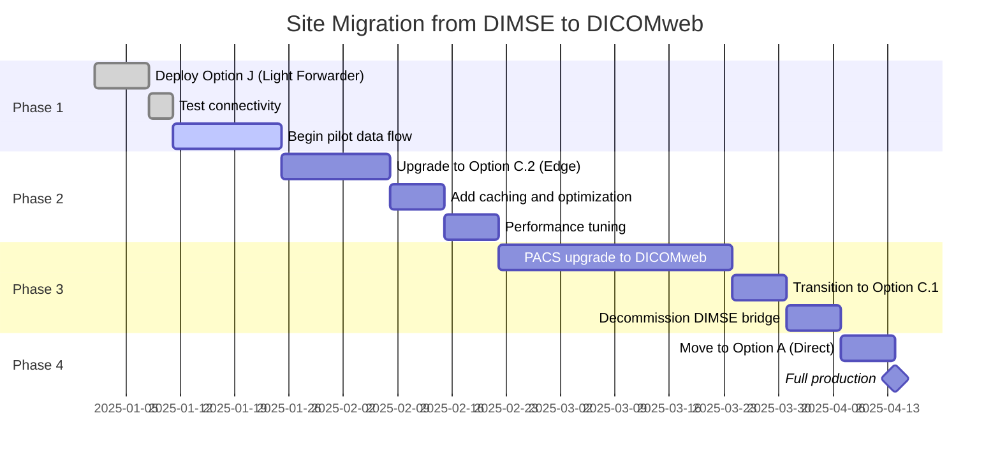
```mermaid
gantt
    title Site Migration from DIMSE to DICOMweb
    dateFormat  YYYY-MM-DD
    section Phase 1
    Deploy Option J (Light Forwarder)    :done, p1, 2025-01-01, 7d
    Test connectivity                     :done, p2, after p1, 3d
    Begin pilot data flow                 :active, p3, after p2, 14d
    
    section Phase 2
    Upgrade to Option C.2 (Edge)          :p4, after p3, 14d
    Add caching and optimization          :p5, after p4, 7d
    Performance tuning                    :p6, after p5, 7d
    
    section Phase 3
    PACS upgrade to DICOMweb              :p7, after p6, 30d
    Transition to Option C.1              :p8, after p7, 7d
    Decommission DIMSE bridge             :p9, after p8, 7d
    
    section Phase 4
    Move to Option A (Direct)             :p10, after p9, 7d
    Full production                       :milestone, after p10
```


## Appendix B — Contracts & schemas

**PDP webhook (reference contract with configurable timeout)**
```
POST https://{site-pdp}/v1/authorize
Content-Type: application/json
X-Timeout-Seconds: 5  # Configurable: 1-30

{
  "patient": {"system": "urn:mrn", "value": "12345"},
  "studyUid": "1.2.840.113619.2.55.3.604688510.892.1599768848.467",
  "exportSnapshot": {"id": "2025-08-14T02:30Z@SITEA"},
  "requestedBy": {"clientId": "radiant-central", "ip": "203.0.113.9"},
  "priority": "routine|urgent|emergency",
  "protocol": "dicomweb|dimse",  # Protocol being used
  "context": {
    "circuitBreakerStatus": "closed|open|half-open",
    "requestAttempt": 1,
    "aeTitle": "RADIANT_EDGE_01"  # For DIMSE requests
  }
}
# 200 OK {"decision":"allow","ttlSeconds":3600}
# 200 OK {"decision":"deny","reason":"Consent withdrawn"}
# Timeout → treat as deny (configurable)
```

**Snapshot JSON with DIMSE support (example)**
```json
{
  "snapshotId": "2025-08-14T02:30Z@SITEA",
  "version": "1.0.0",
  "site": "SITEA",
  "generatedAt": "2025-08-14T02:30:00Z",
  "validUntil": "2025-08-15T02:30:00Z",
  "entries": [{
    "patientRef": {"system":"urn:mrn","value":"12345"},
    "studyUid": "1.2.840.113619.2.55.3.604688510.892.1599768848.467",
    "seriesUids": ["1.3.12.2.1107.5.2.32.35060.300000200803072006092..."],
    "endpoint": {
      "type": "dicom-wado-rs",
      "url": "https://siteA/dicomweb/wado",
      "alternateEndpoints": [{
        "type": "dimse",
        "aeTitle": "SITE_PACS",
        "hostname": "10.0.0.100",
        "port": 104
      }]
    },
    "checksum": "sha256:abcd1234...",
    "lastModified": "2025-08-14T01:00:00Z"
  }],
  "signature": "RS256:xyz789..."
}
```

**DIMSE Configuration Schema**
```json
{
  "siteCode": "SITEA",
  "dimseSettings": {
    "enabled": true,
    "localAeTitle": "RADIANT_SITEA",
    "localPort": 11112,
    "connections": [{
      "name": "Main PACS",
      "remoteAeTitle": "SITEA_PACS",
      "hostname": "pacs.sitea.local",
      "port": 104,
      "timeout": 30000,
      "maxPduSize": 16384,
      "supportedSopClasses": [
        "1.2.840.10008.5.1.4.1.1.1",    // CR
        "1.2.840.10008.5.1.4.1.1.2",    // CT
        "1.2.840.10008.5.1.4.1.1.4"     // MR
      ],
      "transferSyntaxes": [
        "1.2.840.10008.1.2",            // Implicit VR
        "1.2.840.10008.1.2.1",          // Explicit VR
        "1.2.840.10008.1.2.4.70"        // JPEG Lossless
      ],
      "queryModel": "STUDY",
      "retrieveMethod": "C-MOVE",       // or C-GET
      "associationRetry": {
        "maxAttempts": 3,
        "backoffMs": 1000,
        "maxBackoffMs": 30000
      }
    }],
    "autoForwarding": {
      "enabled": false,
      "rules": [{
        "description": "Forward all CR to cloud",
        "sopClass": "1.2.840.10008.5.1.4.1.1.1",
        "destination": "RADIANT_CLOUD",
        "schedule": "* * * * *"         // cron format
      }]
    },
    "caching": {
      "enabled": true,
      "maxSizeGB": 100,
      "ttlHours": 24,
      "strategy": "LRU"
    }
  }
}
```

**Enhanced Audit CSV (header with DIMSE fields)**
```
timestamp,siteCode,snapshotId,correlationId,patientRef,studyUid,seriesUid,sopUid,requesterClientId,sourceIp,decision,httpStatus,bytes,durationMs,priority,circuitBreakerStatus,retryCount,apiVersion,checksumVerified,errorCode,errorMessage,protocol,aeTitle,associationId,transferSyntax,dimseCommand
```

**Circuit Breaker Configuration (per site with DIMSE)**
```json
{
  "siteCode": "SITEA",
  "circuitBreaker": {
    "enabled": true,
    "protocols": {
      "dicomweb": {
        "failureThreshold": 5,
        "failureRateThreshold": 0.5,
        "successThreshold": 2,
        "timeout": 60000,
        "halfOpenRequests": 1,
        "monitoringWindow": 10000
      },
      "dimse": {
        "failureThreshold": 3,        // Lower threshold for DIMSE
        "failureRateThreshold": 0.3,
        "successThreshold": 1,
        "timeout": 120000,             // Longer timeout for DIMSE
        "halfOpenRequests": 1,
        "monitoringWindow": 30000,
        "associationFailures": {
          "trackSeparately": true,
          "threshold": 2,
          "cooldownMs": 300000
        }
      }
    }
  },
  "rateLimiting": {
    "tokensPerSecond": 10,
    "burstCapacity": 20,
    "dimseAssociations": {
      "maxConcurrent": 5,
      "queueSize": 50
    },
    "priorityMultipliers": {
      "emergency": 999,
      "urgent": 2,
      "routine": 1
    }
  },
  "pdpTimeout": {
    "default": 5000,
    "emergency": 1000,
    "dimseOperations": {
      "cFind": 30000,
      "cMove": 300000,
      "cStore": 60000
    },
    "configurable": true,
    "range": {
      "min": 1000,
      "max": 300000
    }
  }
}
```

**Deployment Option Selection API**
```json
{
  "siteAssessment": {
    "siteCode": "SITEA",
    "capabilities": {
      "pacsType": "GE Centricity",
      "dicomwebSupported": false,
      "dimseSupported": true,
      "vnaPresent": false,
      "cloudArchive": null,
      "itResources": "minimal",
      "networkBandwidth": "100Mbps",
      "preferredComplexity": "low"
    }
  },
  "recommendedOptions": [
    {
      "option": "F",
      "name": "Cloud DIMSE Gateway",
      "setupTime": "1 hour",
      "rationale": "DIMSE-only PACS with good bandwidth",
      "requirements": [
        "Configure PACS auto-forwarding",
        "Accept VPN configuration"
      ]
    },
    {
      "option": "J",
      "name": "Lightweight Forwarder",
      "setupTime": "4 hours",
      "rationale": "Alternative with local control",
      "requirements": [
        "Deploy Docker container",
        "Configure PACS routing"
      ]
    }
  ],
  "notRecommended": [
    {
      "option": "A",
      "reason": "Requires DICOMweb support"
    }
  ]
}
```

**Managed Service Activation (Option E)**
```json
{
  "activationCode": "QR:SITEA-2025-08-14-X7Y9Z",
  "appliance": {
    "type": "virtual|physical",
    "model": "RADIANT-EDGE-V2",
    "capabilities": {
      "cpu": 8,
      "memory": 32768,
      "storage": 512000,
      "cache": 102400,
      "networkBandwidth": 1000,
      "protocols": ["dicomweb", "dimse"],
      "maxDimseAssociations": 10
    }
  },
  "configuration": {
    "vpnEndpoint": "vpn.radiant.health",
    "vpnCredentials": "encrypted:...",
    "localPACS": {
      "protocol": "dimse",
      "aeTitle": "SITEA_PACS",
      "host": "10.0.0.100",
      "port": 11112,
      "timeout": 30000,
      "queryRetrieveModel": "STUDY"
    },
    "autoUpdate": {
      "enabled": true,
      "schedule": "02:00-04:00",
      "rollbackOnFailure": true
    },
    "monitoring": {
      "metricsEndpoint": "https://metrics.radiant.health",
      "alerting": "pagerduty",
      "healthCheckInterval": 60
    }
  }
}
```

**Migration Readiness Assessment**
```json
{
  "siteCode": "SITEA",
  "currentState": {
    "protocol": "dimse",
    "option": "J",
    "operationalSince": "2025-01-01",
    "monthlyVolume": {
      "studies": 1500,
      "totalGB": 750
    }
  },
  "migrationReadiness": {
    "pacsUpgradePlanned": true,
    "targetDate": "2025-06-01",
    "targetProtocol": "dicomweb",
    "blockers": [
      "Budget approval pending",
      "Staff training required"
    ]
  },
  "recommendedPath": {
    "phases": [
      {
        "phase": 1,
        "action": "Continue with Option J",
        "duration": "3 months"
      },
      {
        "phase": 2,
        "action": "Deploy Option C.2 (Edge)",
        "duration": "1 month"
      },
      {
        "phase": 3,
        "action": "PACS upgrade to DICOMweb",
        "duration": "2 months"
      },
      {
        "phase": 4,
        "action": "Transition to Option A",
        "duration": "2 weeks"
      }
    ],
    "estimatedCompletion": "2025-07-15"
  }
}
```